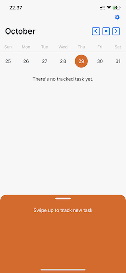
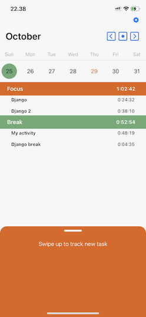
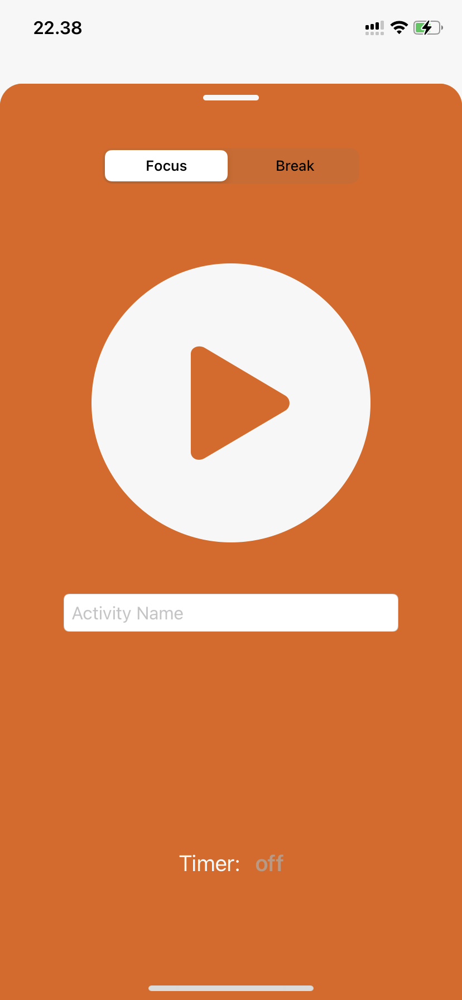

# Fokus Timer
an iOS productivity app to help you track your task everyday

## Features

* Start track a task (or break time) and stop track when you done, or
* Set the timer for however minute you like
* See your tracked tasks and the time you spent

  

## Requirements
* Xcode 
* iOS >= 14

## Tech
this iOS project is using this technologies:
* **Swift 5**
* **SwiftUI**, 
* **Combine**, used alongside swift Timer and other reactive components 
* **Core Data**, for storing tasks
* [SwiftUI CalendarView](https://gist.github.com/mecid/f8859ea4bdbd02cf5d440d58e936faec)
* [KeyboardAvoidanceSwiftUI](https://github.com/V8tr/KeyboardAvoidanceSwiftUI)